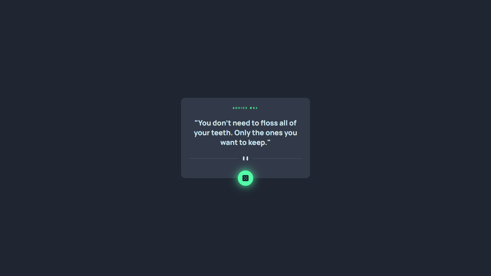

# Frontend Mentor - Advice generator app solution

Esta é uma solução para o [desafio do aplicativo gerador de conselhos no Frontend Mentor](https://www.frontendmentor.io/challenges/advice-generator-app-QdUG-13db).

- [Overview](#overview)
  - [O Desafio](#o-desafio)
  - [Screenshot](#screenshot)
  - [Links](#links)
  - [O que eu aprendi](#o-que-eu-aprendi)
  - [Continued development](#continued-development)
  - [Useful resources](#useful-resources)
- [Author](#author)
- [Acknowledgments](#acknowledgments)

**Note: Delete this note and update the table of contents based on what sections you keep.**

## Overview

### O desafio

Os usuários devem ser capazes de:

- Veja o layout ideal do aplicativo dependendo do tamanho da tela do dispositivo
- Veja os estados de foco para todos os elementos interativos na página
- Gere um novo conselho clicando no ícone de dados

### Screenshot

### Links

- Solution URL: https://www.frontendmentor.io/solutions/integrating-a-3rdparty-api-7w_3eVnPbg
- Live Site URL: https://advice-generator-app-two-tawny.vercel.app/

